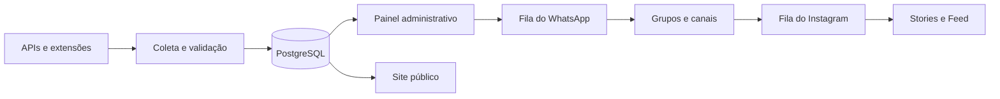

# PromoShop — Ofertas e automação de afiliados

[](https://www.gitguard.com.br/jhonataferreiraar)
[](https://nodejs.org/)
[](https://react.dev/)
[](https://render.com/)

O PromoShop é uma plataforma completa para coletar, revisar, organizar e divulgar ofertas de programas de afiliados. O projeto reúne um site público responsivo, painel administrativo, banco PostgreSQL, filas de publicação e integrações com WhatsApp e Instagram.

O objetivo é manter todo o fluxo em um só lugar: encontrar a promoção, validar o link de afiliado, escolher o público correto, publicar nos canais configurados e acompanhar o resultado.

- Site: [promoshop.jhonatafaraujo.com.br](https://promoshop.jhonatafaraujo.com.br/)
- Painel: [promoshop.jhonatafaraujo.com.br/admin](https://promoshop.jhonatafaraujo.com.br/admin)
- Repositório: [Jhonataferreiraar/promoshop](https://github.com/Jhonataferreiraar/promoshop)

> Este projeto usa links de afiliado e pode receber comissão por compras realizadas por meio deles, sem custo adicional para o visitante. Preço, estoque, frete e condições finais devem sempre ser confirmados na loja.

## Visão geral



O servidor executa a API, o agendador e o publicador do WhatsApp. O painel e o site são construídos em React. As informações operacionais ficam no PostgreSQL, enquanto credenciais criptografadas, sessão do WhatsApp e arquivos temporários protegidos permanecem no disco persistente.

## Principais recursos

### Site público

- Página inicial responsiva com ofertas, cupons, lojas afiliadas e grupos temáticos.
- Busca por produto ou marca, sugestões e filtros por loja, categoria e desconto.
- Página dedicada de cupons e páginas institucionais.
- Favoritos mantidos no navegador do visitante.
- Links identificados como publicidade e afiliado.
- Imagens responsivas e otimizadas para celular e computador.
- Identidade, textos, cores, links sociais e conteúdo legal editáveis pelo painel.
- SEO configurável, sitemap, metadados sociais e integração com Google Search Console.
- Medição de acessos e cliques somente após consentimento.
- Formulário de contato com caixa de entrada administrativa e integração opcional com Brevo.

### Painel administrativo

O painel está dividido em três grupos.

**Operação**

- Visão geral: saúde da automação, números principais e próximas publicações.
- Ofertas: busca, cadastro, edição, pausa, exclusão e publicação manual.
- Revisar ofertas: itens antigos, incompletos ou com baixa qualidade.
- Cupons: cadastro, edição, links curtos, grupos de destino e disparo.
- Caixa de entrada: leitura, resposta e exclusão de mensagens.
- Fila de publicação: pesquisa expansível, publicação imediata, nova tentativa, remoção e edição do grupo de destino.

**Automação**

- Fontes de ofertas.
- WhatsApp e divulgação dos grupos.
- Instagram Stories, Feed, compartilhamento e Destaques.
- Extensão de cupons e extensão dedicada ao Mercado Livre.

**Sistema**

- Acessos e relatórios.
- Saúde, verificação de links e backup operacional.
- Identidade, SEO, qualidade, privacidade e informações legais.
- Segurança e registro de atividades.

## Fontes de ofertas

| Fonte | Forma de integração | Observação |
|---|---|---|
| Mercado Livre | OAuth/API, captura manual e extensão dedicada | Um link comum de produto não é tratado automaticamente como link com comissão. |
| Shopee | Open API de afiliados ou feed autorizado | Exige credenciais e palavras-chave da conta de afiliado. |
| AliExpress | Standard API para Publishers | Usa App Key, segredo e assinatura do programa. |
| Magalu | Programa de afiliados | Usa os dados fornecidos pelo programa. |
| Netshoes | Programa parceiro/rede de afiliados | Fonte adicional quando configurada. |

A coleta respeita desconto mínimo, qualidade, duplicidade, validade do link e intervalo configurado. Também existe busca manual por produto no painel.

Na publicação automática do WhatsApp, a prioridade padrão é **Mercado Livre → Shopee → AliExpress → Magalu**. Se a loja da vez não tiver uma oferta válida para o grupo, o sistema tenta a próxima.

## Roteamento por grupos

Os grupos temáticos usam códigos como `G01`, `G02` e `G04`. Cada grupo pode ter nome, link público, palavras permitidas e termos bloqueados.

O sistema classifica a oferta pelo título, categoria e regras editáveis. Antes da publicação, o administrador pode abrir a fila e trocar manualmente o destino. A mudança atualiza o item, a cópia da oferta e o destino reservado na rodada.

Exemplo: se um produto Kérastase entrar em `G01`, ele pode ser alterado para `G04 — Beleza & Cabelo` diretamente na fila. Itens cujo envio já começou ou terminou ficam bloqueados para impedir uma alteração no meio da publicação.

## WhatsApp

O publicador usa `whatsapp-web.js` e Chromium. A sessão é persistida para que o número não precise ser vinculado depois de cada deploy.

### Como conectar

1. Entre no painel e abra **WhatsApp**.
2. Clique em **Conectar WhatsApp**.
3. Use o QR Code ou o código de conexão apresentado.
4. No celular, abra **WhatsApp → Aparelhos conectados**.
5. Aguarde o estado mudar para **Conectado** e os grupos aparecerem.
6. Escolha os grupos físicos que receberão as publicações e salve.

### Regras de publicação

- Uma rodada escolhe uma oferta adequada para cada grupo temático.
- O intervalo configurado é aplicado entre os grupos da rodada.
- Horário inicial, horário final, máximo por hora e máximo diário são respeitados.
- **Publicar agora** ignora o intervalo normal, mas mantém as proteções de segurança e duplicidade.
- Produtos repetidos e destinos já atendidos são bloqueados.
- O envio de mídia possui confirmação, repetição segura e recuperação após reinício.
- A fila pode ser pesquisada por produto, loja, grupo, estado ou erro.
- O grupo de uma promoção pendente ou com falha pode ser corrigido manualmente.

> Automação no WhatsApp pode estar sujeita aos termos e limites da plataforma. Use apenas grupos administrados por você e participantes que aceitaram receber as ofertas.

## Instagram

O Instagram usa a API oficial da Meta. O PromoShop não solicita nem armazena a senha da conta.

### Stories

- Arte vertical gerada a partir da oferta.
- Temas sazonais, cores e QR Code opcional.
- Filtros por desconto, loja e grupo.
- Horários, intervalo e limite diário independentes.
- Entrada na fila depois da confirmação do WhatsApp.
- Publicar agora, tentar novamente, repetir ou excluir falhas.

### Feed

- Post único ou carrossel.
- Agrupamento das promoções recentes enviadas aos grupos.
- Fila separada dos Stories.
- Intervalo próprio e proteção contra limites temporários da Meta.
- Publicação manual, nova tentativa e exclusão em lote de falhas.

### Compartilhamento e Destaques

- Templates para baixar e publicar em uma conta pessoal.
- Temas de campanha, incluindo Independência do Brasil.
- Capas e Stories introdutórios para Destaques.
- Prévia antes da geração ou entrada na fila.

O guia completo está em [docs/INSTAGRAM-STORIES.md](docs/INSTAGRAM-STORIES.md).

## Extensões do navegador

O repositório contém duas extensões independentes. Elas não devem ser carregadas como se fossem a mesma extensão.

### Extensão de cupons

Pasta: [`extension/`](extension/)

Lê cupons visíveis no Mercado Livre, Shopee, AliExpress ou Magalu e os envia para revisão no painel. O token pode ser criado e revogado pelo administrador.

### Extensão Mercado Livre

Pasta: [`extension-mercadolivre/`](extension-mercadolivre/)

Captura uma oferta individual do Mercado Livre com o link criado pela Barra de Afiliados oficial. A extensão não lê cookies, senha ou dados privados da conta.

### Instalação no Chrome ou Edge

1. Abra `chrome://extensions` ou `edge://extensions`.
2. Ative **Modo do desenvolvedor**.
3. Clique em **Carregar sem compactação**.
4. Selecione somente a pasta da extensão desejada.
5. No painel, abra a aba correspondente e gere o token.
6. Informe na extensão o endereço do PromoShop e o token.

Consulte [`extension/README.md`](extension/README.md) e [`extension-mercadolivre/README.md`](extension-mercadolivre/README.md).

## Inteligência artificial

A IA cria textos e auxilia o roteamento quando habilitada. Os provedores disponíveis incluem Gemini, Groq e Ollama local.

- A mensagem é criada quando a oferta se aproxima da publicação.
- Modelo, estilo e instruções são configuráveis.
- As chaves externas ficam criptografadas.
- Falhas e limites de cota são registrados no painel.
- O comportamento de contingência segue a configuração ativa para evitar conteúdo incompleto.

## Tecnologias

| Camada | Tecnologia |
|---|---|
| Interface | React 19, React DOM e CSS responsivo |
| Build | Vite 7 |
| API | Node.js 22 e Express 5 |
| Banco | PostgreSQL com `pg` |
| Agendamento | `node-cron` e temporizadores controlados |
| WhatsApp | `whatsapp-web.js`, Puppeteer e Chromium |
| Imagens | `sharp` |
| Instagram | Instagram API with Instagram Login |
| Produção | Docker e Render |

## Estrutura do projeto

```text
.
├── src/                       Site e painel em React
├── server/                    API, banco, coletas, segurança e Instagram
│   ├── index.js               Rotas e orquestração principal
│   ├── collectors.js          Coletores das lojas
│   ├── postgresStore.js       Persistência relacional no PostgreSQL
│   ├── secrets.js             Cofre criptografado de credenciais
│   ├── instagram.js           Stories e Feed
│   └── audienceRouting.js     Regras de grupos temáticos
├── worker/                    Processo controlado do WhatsApp
├── extension/                 Extensão de cupons
├── extension-mercadolivre/    Extensão de ofertas do Mercado Livre
├── scripts/                   Testes e manutenção
├── docs/                      Guias específicos
├── deploy/                    Instruções de implantação
├── public/                    Favicons e arquivos públicos
├── Dockerfile                 Imagem de produção
├── render.yaml                Blueprint do Render
└── package.json               Dependências e comandos
```

## Executar localmente

### Requisitos

- Node.js 22 ou compatível.
- npm e Git.
- PostgreSQL, se quiser reproduzir o armazenamento de produção.
- Chrome ou Chromium para testar o WhatsApp.

### Instalação

```bash
git clone https://github.com/Jhonataferreiraar/promoshop.git
cd promoshop
npm install
```

Crie o ambiente local:

```powershell
Copy-Item .env.example .env
```

No Linux ou macOS:

```bash
cp .env.example .env
```

Defina pelo menos uma senha administrativa exclusiva com 12 ou mais caracteres:

```dotenv
ADMIN_PASSWORD=defina-uma-senha-forte
```

Nunca envie o arquivo `.env` ao GitHub.

### Desenvolvimento

```bash
npm run dev
```

- Site e painel: `http://localhost:5173`
- API: `http://localhost:3001`
- Painel: `http://localhost:5173/admin`

O Vite encaminha `/api` para a porta `3001`.

### Modo semelhante à produção

```bash
npm run build
npm start
```

Abra `http://localhost:3001`. No Windows também é possível usar `INICIAR-SITE.cmd` depois da configuração inicial. Não abra `index.html` diretamente: a aplicação depende do servidor e da API.

## Variáveis de ambiente

O arquivo [`.env.example`](.env.example) contém a lista completa.

| Variável | Finalidade |
|---|---|
| `PORT` | Porta da API. Localmente `3001`; no Render `10000`. |
| `SITE_URL` | Endereço usado em links, OAuth e segurança de origem. |
| `PUBLIC_URL` | Endereço público canônico. |
| `ADMIN_USER` | Usuário inicial do painel. |
| `ADMIN_PASSWORD` | Senha inicial obrigatória. |
| `AUTH_SECRET` | Assinatura das sessões administrativas. |
| `SECRETS_ENCRYPTION_KEY` | Criptografia das credenciais do painel. |
| `DATA_ENCRYPTION_KEY` | Criptografia de dados pessoais em repouso. |
| `STORE_BACKEND` | `postgres` em produção ou `file` para compatibilidade local. |
| `DATABASE_URL` | Conexão privada com o PostgreSQL. |
| `PG_POOL_MAX` | Limite do pool de conexões. |
| `PGSSL` | Política TLS do PostgreSQL. |
| `DATA_DIR` | Disco persistente para sessão, cofre e arquivos operacionais. |
| `WORKER_TOKEN` | Autenticação interna entre servidor e worker. |
| `CHROME_PATH` | Caminho do Chrome/Chromium. |
| `WHATSAPP_AUTOSTART` | Reconecta o publicador após reinício. |
| `WEB_CONCURRENCY` | Deve permanecer `1` para proteger a sessão do WhatsApp. |
| `BREVO_API_KEY` | Envio e recebimento opcional de e-mails. |

Credenciais de lojas e IA podem ser cadastradas pelo painel. Valores de infraestrutura e segredos nunca devem ser versionados.

## PostgreSQL

Em produção, o backend recomendado é `postgres`. O schema relacional armazena ofertas, cupons, filas, logs e seções operacionais. A inicialização cria tabelas e índices, aplica políticas de acesso e importa o banco em arquivo apenas quando o PostgreSQL está vazio durante uma migração.

Em `/api/health`, o bloco `storage` deve indicar:

```json
{
  "backend": "postgres",
  "configured": true,
  "connected": true
}
```

Não altere nem exclua `DATA_ENCRYPTION_KEY` depois que existirem dados criptografados. Veja [docs/POSTGRESQL_RENDER.md](docs/POSTGRESQL_RENDER.md).

## Publicação no Render

O [`render.yaml`](render.yaml) configura atualmente:

- Web Service em Docker no plano Pro.
- Região Virginia e deploy por commit em `master`.
- PostgreSQL como backend.
- Chromium instalado na imagem.
- Uma única instância do processo para proteger a sessão do WhatsApp.
- Disco persistente de 5 GB em `/var/data`.
- Health check em `/api/health`.

### Implantação

1. No Render, escolha **New → Blueprint** e conecte o repositório.
2. Confirme o serviço descrito em `render.yaml`.
3. Crie um PostgreSQL na mesma região.
4. Configure `DATABASE_URL` com a **Internal Database URL**.
5. Defina `ADMIN_PASSWORD` e as variáveis secretas.
6. Preserve `SECRETS_ENCRYPTION_KEY` e `DATA_ENCRYPTION_KEY` em todos os deploys.
7. Aguarde o health check e confirme `/api/health`.
8. Entre no painel, configure as integrações e vincule o WhatsApp.

Um `SIGTERM` no processo anterior durante o deploy é esperado: o Render encerra a instância antiga quando promove a nova versão. O importante é a nova instância conectar ao PostgreSQL e alcançar **Your service is live**.

## Backup e recuperação

O painel permite baixar e restaurar um backup operacional de configurações, links e cupons. Por segurança, ele não inclui senhas, chaves de API, sessão do WhatsApp, mensagens de contato, consentimentos ou identificadores privados de audiência.

Mantenha também backups do PostgreSQL e do disco persistente. A sessão e o cofre criptografado dependem do conteúdo e das chaves corretas.

## Segurança

O projeto inclui:

- Sessão administrativa em cookie `HttpOnly` e proteção CSRF.
- Bloqueio progressivo de tentativas de login.
- Cabeçalhos CSP, HSTS e `X-Frame-Options`.
- Credenciais e dados pessoais criptografados separadamente.
- Respostas públicas sem configurações internas.
- Validação de URLs remotas contra SSRF.
- Limites de entrada e tokens distintos para as extensões.
- PostgreSQL com privilégios restritos e Row Level Security.
- Auditoria de dependências e busca de segredos no CI.
- Credenciais aleatórias nos testes automatizados.
- Proteção contra duplicidade nas filas e entregas.

O repositório é verificado pelo [GitGuard](https://www.gitguard.com.br/jhonataferreiraar). O selo no início deste README aponta para o perfil de segurança concedido ao projeto.

Nunca publique `.env`, `data/`, `.wwebjs_auth/`, URLs de banco com senha, cookies, tokens, chaves OAuth, chaves de IA ou backups privados.

Se uma credencial real for enviada ao Git, removê-la do arquivo não basta: revogue-a no provedor, gere outra e atualize a produção.

## Testes

| Comando | Verificação |
|---|---|
| `npm run build` | Compilação do site e painel. |
| `npm run test:security` | Autenticação, CSRF, cabeçalhos e APIs públicas. |
| `npm run test:secret-scan` | Credenciais e chaves versionadas. |
| `npm run test:secrets` | Criptografia do cofre. |
| `npm run test:data-encryption` | Criptografia de dados pessoais. |
| `npm run test:safe-remote` | Proteção das requisições externas. |
| `npm run test:postgres` | Persistência e migração PostgreSQL. |
| `npm run test:search` | Busca e relevância. |
| `npm run test:images` | Imagens responsivas. |
| `npm run test:seo` | Identidade e dados estruturados. |
| `npm run test:routing` | Palavras-chave e grupos. |
| `npm run test:whatsapp-schedule` | Agenda e intervalos. |
| `npm run test:whatsapp-store-priority` | Prioridade das lojas. |
| `npm run test:whatsapp-dedup` | Bloqueio de duplicatas. |
| `npm run test:whatsapp-media` | Download e envio de mídia. |
| `npm run test:whatsapp-process` | Processo do worker. |
| `npm run test:instagram` | Filas e limites do Instagram. |
| `npm run test:extension` | Entrada das duas extensões. |

O workflow [`.github/workflows/security.yml`](.github/workflows/security.yml) executa build, auditoria e testes em pushes para `master` e pull requests.

## Solução de problemas

### A página fica carregando depois do F5

Confirme `/api/health`, PostgreSQL e uso de memória. O frontend não deve esperar o WhatsApp conectar para entregar a página.

### WhatsApp fica em “Autenticado”

O número foi vinculado, mas o cliente ainda sincroniza conversas e grupos. Confirme o disco persistente, memória, apenas um processo (`WEB_CONCURRENCY=1`) e os logs do worker.

### QR Code ou código não aparece

Espere o worker iniciar. Se existir uma sessão parcial, desconecte pelo painel antes de começar do zero. Não execute duas instâncias com a mesma sessão.

### Produto foi para o grupo errado

Abra **Fila de publicação**, use a lupa, localize o produto e altere **Grupo de destino**. Depois ajuste as palavras-chave para melhorar as próximas classificações.

### Intervalo parece não ser respeitado

O intervalo é aplicado entre os grupos da rodada. **Publicar agora** é prioritário. Confira também itens forçados ou uma rodada retomada após reinício.

### Instagram informa excesso de ações

A Meta aplicou limite temporário. Não force tentativas seguidas. O PromoShop pausa a fila e usa espera progressiva.

### Imagem indisponível no Instagram

O post é bloqueado quando a imagem não pode ser carregada ou convertida. Corrija a URL da oferta antes de tentar novamente.

### API de IA retorna `429`

O provedor atingiu cota. Aguarde a janela, troque o provedor ou adicione créditos.

### Mercado Livre retorna `403` ao gerar link

Use a extensão dedicada e a Barra de Afiliados oficial para capturar o link de uma página individual válida.

### Render mostra `SIGTERM`

Geralmente é o encerramento da instância anterior. Só é problema se a nova instância não alcançar o health check ou reiniciar continuamente.

## Documentação adicional

- [PostgreSQL no Render](docs/POSTGRESQL_RENDER.md)
- [Instagram Stories e Meta](docs/INSTAGRAM-STORIES.md)
- [Deploy no Render](deploy/DEPLOY-RENDER.md)
- [Deploy alternativo em Azure VM](deploy/DEPLOY-AZURE.md)
- [Extensão de cupons](extension/README.md)
- [Extensão Mercado Livre](extension-mercadolivre/README.md)

## Licenças e responsabilidade

As marcas Mercado Livre, Shopee, AliExpress, Magalu, Netshoes, WhatsApp, Instagram, Meta, Google, Render e GitGuard pertencem aos seus titulares. As integrações dependem das APIs, programas e termos oferecidos por cada plataforma.

O operador é responsável por usar conteúdos autorizados, confirmar preços e links, cumprir os programas de afiliados, respeitar privacidade e regras contra spam e manter credenciais e backups seguros.
